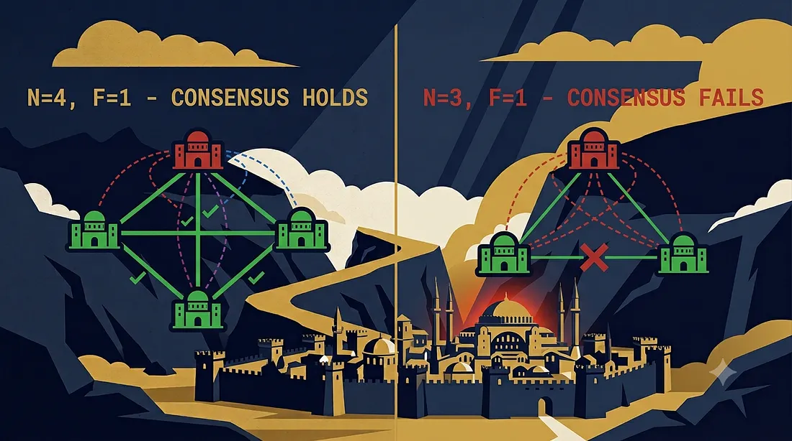

# Byzantine Generals Problem

Two generals sit on opposite hills, staring down at a walled city between them. Their combined armies can take it. Either army alone will be slaughtered. They need to attack at the exact same moment, but the only way to coordinate is a messenger who has to walk through enemy territory to deliver the message.

Send the message, and the messenger might get captured, and now the attack never happens. Send two messengers to be safe, and now you have a new problem: what if a messenger switches sides and delivers a fake message on purpose?

This is the Byzantine Generals Problem and it's not really about generals. It's about what happens when the things trying to coordinate with you aren't just unreliable. They might be actively lying.

Us engineers who've dealt with distributed systems know the first kind of failure intimately when making projects or managing complex software. A server times out. A network partition drops packets. A process crashes mid-write. These are **crash faults** and they're the "easy" case, because a crash fault has a tell: silence.
No response.
A timeout catches it.

The Byzantine Generals Problem asks a scarier question: what if the node doesn't go silent? What if it stays online, keeps responding, and tells node A one thing and node B another and both messages look perfectly valid?

*Press enter or click to view image in full size*


Well, let's make the distinction precise because the whole article rests upon it.
A **crash fault** (also called a "fail-stop" fault) is a node that stops participating. It might crash, lose power, get network-partitioned, or hang. But crucially: **when it does respond, it tells the truth.** It never sends conflicting information to different peers. The failure mode is binary — up or down, responsive or silent.

A **Byzantine fault** is named after a 1982 thought experiment by Lamport, Shostak, and Pease, but the failure mode it describes is much older than computers: betrayal.
Betrayal is the age old sin.

A Byzantine-faulty node can:

- Send different values to different peers
- Send messages that are well-formed and cryptographically valid, but wrong
- Collude with other faulty nodes
- Selectively respond — answering some nodes, ignoring others
- Delay messages strategically
- Behave perfectly correctly 99% of the time, then lie exactly when it matters

The name comes from a specific version of the parable: several Byzantine generals must unanimously decide to attack or retreat. Some generals might be "traitors". The traitors don't need to convince everyone to retreat they just need to make the *loyal* generals disagree with each other about what was decided. That disagreement alone is enough to defeat the army.

This reframes the entire problem. With crash faults, the system's job is **failure detection** — figure out who's down, route around them. With Byzantine faults, the system's job is **agreement despite conflicting testimony** — and you can't solve that by talking to the suspect node more. You solve it by cross-referencing everyone *else*.

*Press enter or click to view image in full size*


The Byzantine Generals Problem was formalized in a 1982 paper by Leslie Lamport, Robert Shostak, and Marshall Pease titled *"The Byzantine Generals Problem."* Strip away the parable and the formal requirements are:

Given `n` generals (nodes), of which at most `f` are traitors (Byzantine-faulty), design a protocol such that:

1. **Agreement (Consistency):** All loyal generals decide on the same plan of action.
2. **Validity (Non-triviality):** If the commanding general is loyal, every loyal general obeys the order he actually sent.

Notice condition 2. It's not enough for everyone to agree — they could all agree on the *wrong* thing. The protocol has to guarantee agreement **and** that the agreement reflects reality when the source is honest. A protocol that makes everyone agree to always retreat, regardless of orders, trivially satisfies "agreement" but is useless. This is the part most casual explanations skip, and it's exactly why the problem is hard: you need consensus *and* correctness simultaneously, under adversarial conditions.

Lamport's paper proved something that surprises most people the first time they see it: **with only 3 generals, 1 of whom is a traitor, the problem is unsolvable — no matter what protocol you use.** You need at least 4. That's the seed of the 3f+1 result we'll prove properly in the next section.

It's tempting to file this under "interesting CS trivia," but Byzantine fault tolerance underpins systems you likely depend on:

- **Blockchain consensus** — every node in a permissionless network like Ethereum is a stranger. Some may be actively malicious, trying to double-spend or fork the chain. BFT-style consensus (or its economic cousin, Nakamoto consensus) is the only way strangers agree on one truth.
- **Aircraft flight control systems** — Boeing 777's flight control computers use Byzantine fault-tolerant voting ( they call it triple-triple redundant primary flight architecture ) because a single faulty sensor giving *different* corrupted readings to different subsystems is a real failure mode at 35,000 feet, not a hypothetical.
- **Spacecraft** — NASA's use of BFT-inspired designs (SIFT, and later work) for the same reason: radiation-induced bit flips don't crash a chip cleanly, they corrupt it unpredictably, which looks exactly like a lying node.
- **Multi-party financial systems** — clearinghouses and interbank settlement systems where no single participant can be blindly trusted, because the incentive to lie is literally money.

The pattern across all of these: whenever the "nodes" are independent actors with potentially different incentives (different companies, different hardware batches, different physical environments, or actual adversaries), crash-fault tolerance isn't enough. You have to assume someone might lie, and design for it.

So, lets look at the math shall we?

Here's the claim: **to tolerate** `f` **Byzantine nodes, you need at least** `n = 3f + 1` **total nodes.** Compare that to crash faults, which only need `n = 2f + 1`. That extra `f` is the entire cost of tolerating liars instead of silence.

The intuition in one line: **a lying node can vote on both sides of a dispute, so you need enough honest votes to win *even after* you subtract every possible position the liars might take.**

Formally, split your `n` nodes into three groups in the worst case: `f` Byzantine nodes lying to Group A, the same `f` Byzantine nodes lying to Group B, and the honest majority. For Group A and Group B to reach *different* conclusions is exactly what breaks Agreement. To prevent this, the honest nodes (`n − f` of them) must outnumber the combined worst case of "faulty nodes plus the largest possible honest minority that got fed a consistent lie":

```
n − f > f + f → n > 3f → n ≥ 3f + 1
```

That's it. That's the whole equation. Everything else is bookkeeping to prove the bound is tight ( that 3f actually fails — Lamport's original 3-general, 1-traitor impossibility result is that tightness proof, and it's the base case of this exact inequality with f=1: 3(1)=3, which fails, so you need 3(1)+1=4 ).

The practical translation: if you want a blockchain network to survive **10 malicious validators**, you don't need 21 nodes — you need **31**. That "+1" isn't rounding, it's the deciding vote that breaks the tie between the honest camp and the lie.

```
n ≥ 3f + 1

where:
  n = total number of nodes
  f = maximum number of Byzantine (malicious/faulty) nodes tolerated
```

Now, I know all of you are bored with the numbers and the mathematical trivia. Theory's cheap.
Let's break it and fix it in code.
I coded this in go because that's what I am doing for a few days and it's fast

We'll simulate `n` validator nodes voting on a single value (think: "is this block valid?").
Some nodes are Byzantine and vote differently to different peers.

We'll run it at `n=4, f=1` (satisfies 3f+1) and then at `n=3, f=1` (violates it) and watch consensus fail.

*Press enter or click to view image in full size*

<div class="demo-embed" data-width="800" data-height="560">
  <iframe src="./consensus-demo.html" height="480" loading="lazy" title="Consensus simulation"></iframe>
</div>

```go
package main

import (
 "fmt"
 "math/rand"
)

type Node struct {
 ID        int
 Byzantine bool
}

// A Byzantine node can send a DIFFERENT vote to each peer.
// An honest node sends the SAME true vote to everyone.
func (n Node) VoteTo(peerID int, trueValue bool) bool {
 if !n.Byzantine {
  return trueValue
 }

 // Malicious behavior: lie unpredictably,
 // different peers see different things.
 return rand.Intn(2) == 0
}

// Simulates one round: every node collects votes from
// every other node, then decides via simple majority.
func simulateRound(nodes []Node, trueValue bool) map[int]bool {
 decisions := make(map[int]bool)

 for _, receiver := range nodes {
  votesForTrue := 0
  votesForFalse := 0

  for _, sender := range nodes {
   if sender.ID == receiver.ID {
    continue
   }

   vote := sender.VoteTo(receiver.ID, trueValue)

   if vote {
    votesForTrue++
   } else {
    votesForFalse++
   }
  }

  decisions[receiver.ID] = votesForTrue > votesForFalse
 }

 return decisions
}

func checkAgreement(decisions map[int]bool) bool {
 var first bool
 i := 0

 for _, decision := range decisions {
  if i == 0 {
   first = decision
  } else if decision != first {
   return false // Disagreement found.
  }

  i++
 }

 return true
}

func main() {
 trueValue := true // The "honest" proposed value, e.g. "block is valid".

 fmt.Println(" Case 1: n=4, f=1 (satisfies n >= 3f+1) ")

 nodes4 := []Node{
  {ID: 0, Byzantine: false},
  {ID: 1, Byzantine: false},
  {ID: 2, Byzantine: false},
  {ID: 3, Byzantine: true},
 }

 d1 := simulateRound(nodes4, trueValue)
 fmt.Println(d1, "| Agreement:", checkAgreement(d1))

 fmt.Println(" Case 2: n=3, f=1 (violates n >= 3f+1)")

 nodes3 := []Node{
  {ID: 0, Byzantine: false},
  {ID: 1, Byzantine: false},
  {ID: 2, Byzantine: true},
 }

 d2 := simulateRound(nodes3, trueValue)
 fmt.Println(d2, "| Agreement:", checkAgreement(d2))
}
```

(it was absolutely fun implementing this not gonna lie)

Run Case 2 a handful of times. With only 3 nodes and 1 Byzantine, each honest node only hears from **one other honest node** plus the liar — so the liar's single vote is enough to swing a 1-vs-1 tie into disagreement between the two honest nodes. At `n=4`, each honest node hears from **two** other honest nodes plus the liar — 2-vs-1, the liar's lie gets outvoted no matter who they target. That's `n ≥ 3f+1` happening live, not as an abstraction.

*Press enter or click to view image in full size*



Now lets simulate this on a blockchain scenario:
We simulate a double vote attack on block finality.
For example, Rahul invests ₹1 lakh in Bitcoin, and a transaction is included in a new block. The blockchain's validators must agree that this block is valid and final. If enough malicious validators try to approve two conflicting versions of the block, Rahul could potentially see his transaction appear finalized while another part of the network sees a conflicting transaction.

In technical words, let's make this concrete with the exact application we flagged: **blockchain validator consensus**, the way protocols like Tendermint actually reason about it.
**The setup:** A proof-of-stake chain has a validator set of `n = 100` validators, weighted equally for simplicity. A block proposer broadcasts a new block. Validators vote to finalize it. The chain's security assumption, per the math above, is that it tolerates Byzantine validators up to:

`f < n / 3 → f < 33.3 → f_max = 33`

This is *the exact number quoted in Tendermint and Ethereum's Casper FFG design docs* — "up to 1/3 of stake can be Byzantine and the chain still finalizes safely." Now you know precisely where that fraction comes from: it's `3f+1` rearranged and expressed as a percentage instead of a raw count.

**The attack we simulate:** 33 malicious validators attempt an **equivocation attack** voting to finalize *two conflicting blocks* at the same height, sending Block A's vote to one set of honest nodes and Block B's vote to another, trying to split the honest 67 into two camps that each *think* they have finality.

*Press enter or click to view image in full size*

<div class="demo-embed" data-width="800" data-height="560">
  <iframe src="./equivocation-demo.html" height="480" loading="lazy" title="Equivocation attack simulation"></iframe>
</div>

```go
package main

import "fmt"

type Validator struct {
 ID          int
 Byzantine   bool
}

// Byzantine validators equivocate: vote Block A to targetGroup 0, Block B to targetGroup 1
func (v Validator) Vote(targetGroup int) string {
 if !v.Byzantine {
  return "BLOCK_A" // honest validators only ever see/vote the real block
 }
 if targetGroup == 0 {
  return "BLOCK_A"
 }
 return "BLOCK_B"
}

const quorum = 0.667 // 2/3+ needed to finalize, matches n >= 3f+1 derived threshold

func tallyFinality(votes []string, n int) (string, bool) {
 counts := map[string]int{}
 for _, v := range votes {
  counts[v]++
 }
 for block, count := range counts {
  if float64(count)/float64(n) >= quorum {
   return block, true
  }
 }
 return "", false
}

func main() {
 n := 100
 f := 33 // exactly at the tolerated maximum, f = n/3 rounded down

 honest := n - f
 group0Size := honest / 2 // honest split arbitrarily into two "camps" for the attack
 group1Size := honest - group0Size

 var votesGroup0, votesGroup1 []string

 // Honest votes always agree: BLOCK_A
 for i := 0; i < group0Size; i++ {
  votesGroup0 = append(votesGroup0, "BLOCK_A")
 }
 for i := 0; i < group1Size; i++ {
  votesGroup1 = append(votesGroup1, "BLOCK_A")
 }

 // Byzantine validators equivocate: lie BLOCK_B to group1, truth-mimic BLOCK_A to group0
 byz := Validator{Byzantine: true}
 for i := 0; i < f; i++ {
  votesGroup0 = append(votesGroup0, byz.Vote(0))
  votesGroup1 = append(votesGroup1, byz.Vote(1))
 }

 resultA, finalizedA := tallyFinality(votesGroup0, n)
 resultB, finalizedB := tallyFinality(votesGroup1, n)

 fmt.Printf("Group 0 sees: %d votes -> finalized=%v (%s)\n", len(votesGroup0), finalizedA, resultA)
 fmt.Printf("Group 1 sees: %d votes -> finalized=%v (%s)\n", len(votesGroup1), finalizedB, resultB)
}
```


**From theory to real protocols.** Knowing you need `n ≥ 3f+1` doesn't tell you *how* nodes actually reach agreement — that's what PBFT, Tendermint, and HotStuff solve.

**PBFT (Practical Byzantine Fault Tolerance, Castro & Liskov, 1999)** was the first protocol to make BFT usable outside academia. It works in rounds: a primary node proposes a value, then nodes go through a **pre-prepare → prepare → commit** cycle, each phase requiring `2f+1` matching messages before advancing. If the primary is faulty, replicas trigger a **view change** to elect a new one. The catch: every phase requires all-to-all messaging, so total traffic is `O(n²)` — fine for tens of nodes, unworkable for thousands.

**Tendermint** and **HotStuff** are the blockchain-era answer to that scaling wall. Tendermint uses a rotating-proposer model with the same `2f+1` voting threshold but a simpler two-phase (prevote/precommit) round, giving instant finality once a block clears quorum — no waiting for confirmations like Bitcoin. HotStuff (which Facebook's Libra/Diem and Aptos build on) restructured the messaging into a linear chain of votes routed through the leader, cutting communication from `O(n²)` to `O(n)` — the actual engineering breakthrough that made BFT consensus viable at internet scale.

**Where crash-fault tolerance (Raft, Paxos) is still the right call:** if every node is inside one company's infrastructure — your own data centers, your own hardware, no adversarial incentive — you don't need to pay the 3f+1 tax or the O(n²)/O(n) messaging overhead of BFT. Raft's `2f+1` and simple leader election is cheaper and easier to reason about. BFT earns its cost specifically when nodes are mutually distrusting parties: different companies, public blockchains, or safety-critical hardware where a corrupted component can't be assumed to just go silent.

*After all this I just want to say that a crash fault breaks the conversation. A Byzantine fault breaks your ability to trust the conversation at all — and that's why every serious BFT protocol spends its complexity budget not on waiting for stragglers, but on cross-checking liars.*

I hope everyone likes it and give me honest feedback.

Thank you,

Siddharth Paul